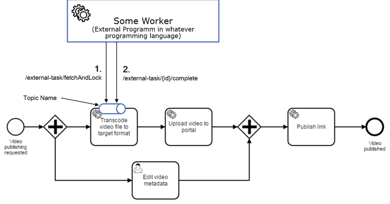
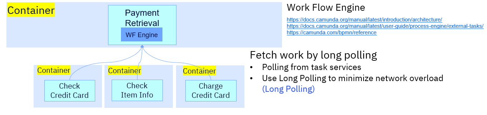
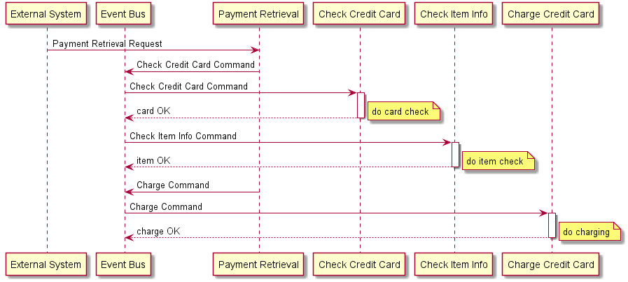
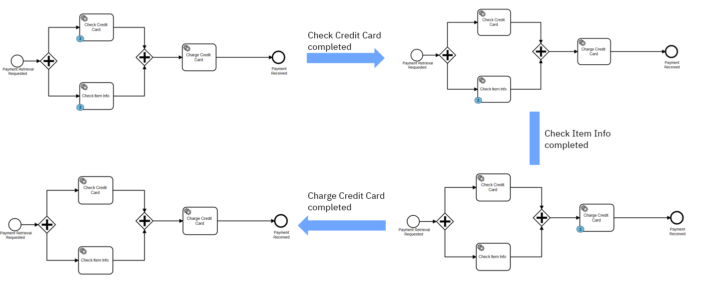

# camunda-external-task-demo
A demo for using [Camunda BPM Engine external task patter](https://docs.camunda.org/manual/latest/user-guide/process-engine/external-tasks/) to do service orchestration.



Highlights:

* Demonstrates **Temporal decoupling** / **Better scaling** / **Avoid Timeouts** use cases.
* Demonstrates implementing [Camunda BPM Engine as an embedded component](https://docs.camunda.org/manual/latest/introduction/architecture/#embedded-process-engine) to an REST service project. The process engine is added as an application library to a custom application which is a convenient way and small footprint for modernizing existing applicaitons.
* Camunda official demos are usually based on spring tech, which is easy to integrate with camunda. This demo embedded camunda workflow engine into a pure JAX-RS web service, no anymore spring dependencies. This demonstrates Camunda can also work well with non-spring tech stacks. 





### 1. Maven Build

```bash
$git clone
$cd camunda-external-task-demo
$mvn clean package -f camunda-embedded-engine-demo-model/pom.xml
$mvn clean package -f camunda-embedded-engine-demo/pom.xml
$mvn clean package -f simple-charge-card-worker/pom.xml
$mvn clean package -f simple-check-card-worker/pom.xml 
$mvn clean package -f simple-check-item-worker/pom.xml 
```

### 2. Build Container Images

```bash
$docker build -t camunda-embedded-engine-demo:latest camunda-embedded-engine-demo/.
$docker build -t simple-check-card-worker:latest simple-check-card-worker/.
$docker build -t simple-check-item-worker:latest simple-check-item-worker/.
$docker build -t simple-charge-card-worker:latest simple-charge-card-worker/.
```

### 3. Deploy

Deploy the services, Camunda web app and postgresql containers to Code Ready Container. The work flow engine is embedded in camunda-embedded-engine-demo service, and postgresql is the database for workflow engine and data persistent. Camunda web app can be used to monitor the workflow execution, and needs to connect to the same postgresql. You can find details in `deployments.yaml`.

The following script is for deploying on Code Ready Container.
```bash
# create a new openshift project with name 'camunda-demo'
$oc new-project camunda-demo
# tag the images for pushing to openshift internal image registry
$docker tag camunda-embedded-engine-demo:latest default-route-openshift-image-registry.apps-crc.testing/camunda-demo/camunda-embedded-engine-demo:latest
$docker tag simple-check-card-worker:latest default-route-openshift-image-registry.apps-crc.testing/camunda-demo/simple-check-card-worker:latest
$docker tag simple-check-item-worker:latest default-route-openshift-image-registry.apps-crc.testing/camunda-demo/simple-check-item-worker:latest
$docker tag simple-charge-card-worker:latest default-route-openshift-image-registry.apps-crc.testing/camunda-demo/simple-charge-card-worker:latest
# push to openshift internal image registry
$docker push default-route-openshift-image-registry.apps-crc.testing/camunda-demo/camunda-embedded-engine-demo:latest
$docker push default-route-openshift-image-registry.apps-crc.testing/camunda-demo/simple-check-card-worker:latest
$docker push default-route-openshift-image-registry.apps-crc.testing/camunda-demo/simple-check-item-worker:latest
$docker push default-route-openshift-image-registry.apps-crc.testing/camunda-demo/simple-charge-card-worker:latest
# deploy by yaml definition
$oc apply -n camunda-demo -f camunda-db-pvc-crc.yaml
$oc apply -n camunda-demo -f deployments.yaml
```
If you want to deploy on Openshift Clusters on IBM Cloud, please first push the images to internal image registry on Openshift on IBM Cloud, and use `camunda-db-pvc-ibmc.yaml` to creat pvc with dynamic provision.

Camunda web app needs priviledge to startup, use the following command. Camunda web app is optional, it is just used to visualize workflow execution.

```bash
$oc adm policy add-scc-to-user anyuid -z default
```

### 4. Test

Use the following command to send a request to camunda-embedded-engine-demo service, and a new camunda work flow process instance will be created and started in background.

```bash
$curl --location --request POST 'http://camunda-embedded-engine-demo-route-camunda-demo.apps-crc.testing/camunda-embedded-engine-demo/webapi/myresource' \
--header 'Content-Type: application/json' \
--header 'Content-Type: text/plain' \
--data-raw '{
	"doCardCharge": true,
	"doCheckCard": true,
	"doCheckItem": true,
	"cardNumber": "0123456789",
	"amount": 335.0,
	"item": "item-def"
}'
```

Then if you spin up simple-check-item-worker, simple-check-card-worker, simple-charge-card-worker one by one, you can monitor the process of external workers execution in camunda web. The following image shows the workflow and external worker execution sequence.



Usually we should spin up all workers at the same time, so check item and check card should work parallelly according to the work flow definition.

<u>Reference:</u>

[Understanding and Using **External Tasks**](https://camunda.com/best-practices/invoking-services-from-the-process/#_understanding_and_using_strong_external_tasks_strong)

[Camunda Microservices and BPM Whitepaper](https://assets.ctfassets.net/vpidbgnakfvf/1YnPDinYJeqYCEK06k82a6/4dc12579c43b51468603323af0a1ac2f/Microservices_and_BPM.pdf)

[The Job Executor: What Is Going on in My Process Engine?](https://blog.camunda.com/post/2019/10/job-executor-what-is-going-on-in-my-process-engine/)